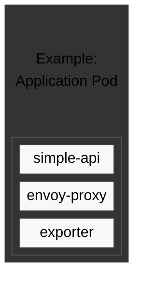

---
# try also 'default' to start simple
theme: default
title: Deplojujeme aplikaci v kubernetes
date: 29.1.2026
author: Jan Dvořák
email: jan.dvorak@rocketmail.com
info: |
  ## Slidev Starter Template
  Presentation slides for developers.

  Learn more at [Sli.dev](https://sli.dev)
# apply UnoCSS classes to the current slide
layout: cover
# https://sli.dev/features/drawing
drawings:
  persist: false
transition: slide-left
mdc: true
duration: 40min
---


---
layout: simple
split: 55
---

::header::

Co je Pod 

::left::


- Reprezentuje běžící aplikaci a její prostředí
- Obsahuje jeden nebo více kontejnerů
- Běží na jedno konkrétním nodu

::right::

```yaml [simple-api-pod] {all} twoslash
apiVersion: v1
kind: Pod
metadata:
  annotations:
    prometheus.io/scrape: "true"
  generation: 1
  labels:
    app: simple-api
  name: simple-api-pod
  namespace: simple-api
spec:
  containers:
  - image: registry/simple-api:v1.0.0
    imagePullPolicy: Always
    name: simple-api
  securityContext: {}
  serviceAccount: default
  serviceAccountName: default
```

---
layout: simple
clicks: 6
---

::header::

Co je Pod: pokračování

::left::

- Je považován za ephemeral 
  (může kdykoliv zmizet a vzniknout znovu)
- Lokální data v Podu nejsou perzistentní
- V k8s síti má unikátní ip adressu 
  - v případě použití deploymentu i hostname


::right::

```yaml [simple-api-pod] {all|1-2|3-5|7-8|9-10|11-15|all} twoslash
apiVersion: v1
kind: Pod
metadata:
  annotations:
    prometheus.io/scrape: "true"
  generation: 1
  labels:
    app: simple-api
  name: simple-api-pod
  namespace: simple-api
spec:
  containers:
  - image: registry/simple-api:v1.0.0
    imagePullPolicy: Always
    name: simple-api
  securityContext: {}
  serviceAccount: default
  serviceAccountName: default
```


---
layout: simple-80-20
clicks: 2
---

::header::

Pod: Lifecycle

::left::

<div class="note" v-if="$slidev.nav.clicks === 0">

#### Create

</div>

<div class="note" v-if="$slidev.nav.clicks === 1">

#### Status

</div>

<div class="note" v-if="$slidev.nav.clicks === 2">

#### Extended

</div>

::right::

<div class="note" v-if="$slidev.nav.clicks === 0">

```bash
# kubectl create -f ./simple-api-pod.yaml
pod/simple-api-pod created
```

</div>

<div class="note" v-if="$slidev.nav.clicks === 1">

```bash
# kubectl get pods 
NAME             READY   STATUS    RESTARTS   AGE
simple-api-pod   1/1     Running   0          3m37s
```

</div>

<div class="note" v-if="$slidev.nav.clicks === 2">

```bash
# kubectl get pods -o wide
NAME             READY   STATUS    RESTARTS   AGE   IP          NODE
simple-api-pod   1/1     Running   0          52m   10.38.4.6   wks-220a66-00004
```

</div>


---
layout: twist
twistAt: 5
clicks: 5
---

::header::

Pod: pokračování

::left::

<div class="note" v-if="$slidev.nav.clicks < 6">



</div>

::right::

<div class="note" v-if="$slidev.nav.clicks === 1">

- Interně Pod reprezentuje container prostředí
  - linux namespaces
  - cgroups
  - rootfs je container image

</div>

<div class="note" v-else-if="$slidev.nav.clicks === 2">

- Interně Pod reprezentuje container prostředí
  - linux namespaces
  - cgroups
  - rootfs je container image
- Containery jsou běžící aplikace v tomto prostředí

</div>

<div class="note" v-else-if="$slidev.nav.clicks === 3">

- Interně Pod reprezentuje container prostředí
  - linux namespaces
  - cgroups
  - rootfs je container image
- Containery jsou běžící aplikace v tomto prostředí
- Lze však definovat pouze jeden 
  - žádná vysoká dostupnost

</div>

<div class="note" v-else-if="$slidev.nav.clicks === 4">

- Potřebujeme tedy objekt který "vyrobí" více Podů

</div>

<div class="note" v-else-if="$slidev.nav.clicks === 5">

- Potřebujeme tedy objekt který "vyrobí" více Podů

</div>

::twist::

<div class="note" v-if="$slidev.nav.clicks === 5">

Deployment !

</div>


---
layout: simple
---

::header::

Deployment

::left::

- Standartní objekt pro deploy containerů
- Definujeme v něm:
  - Template dle kterého se pody vytvoří
  - Počet replik a na jakých nodech
- Některé atributy podů se dědí z deploymentu
- Pody mají unikátní jméno a hostname v rámci clusteru


<i>
Podobné objekty: statefullsety, daemonsety 
  - neprobíráme
</i>
::right::

```yaml [deployment.yaml] twoslash
apiVersion: apps/v1
kind: Deployment
metadata:
  annotations:
    deployment.kubernetes.io/revision: "1"
  labels:
    app: simpleapi
  name: simpleapi
  namespace: simpleapi
spec:
  progressDeadlineSeconds: 600
  replicas: 1
  revisionHistoryLimit: 10
  ...
```

---
layout: simple
---

::header::

Problém: požadavky app runtimu

::left::

- aplikace potřebují nejen spustit ale také:
  - mají nějakou konfiguraci
  - mohou chtít někam ukládat data
  - potřebují citlivé údaje jako heslo, klíče, certifikáty

::right::

---
layout: twist
clicks: 3
twistAt: 3
---

::header::

Konfigurace applikačního kontejneru

::left::

<div class="note" v-if="$slidev.nav.clicks === 1">

- Argumenty

</div>


<div class="note" v-if="$slidev.nav.clicks === 2">

- Argumenty

- Environment proměnné

</div>

<div class="note" v-if="$slidev.nav.clicks === 3">

- Argumenty

- Environment proměnné

- Konfigurační soubory

</div>


::right::

<div class="note" v-if="$slidev.nav.clicks === 1">

V rámci deploymentu je možné definovat hodnotu args

```yaml deployment.yaml
- args
```
</div>

<div class="note" v-if="$slidev.nav.clicks === 2">

V rámci deploymentu je možné definovat ppřípadně env

```yaml deployment.yaml
- env
```
</div>


<div class="note" v-if="$slidev.nav.clicks === 3">

Pro větší konfigurační soubory potřebujeme samostatný objekt

</div>

::twist:: 

tzv. Config Mapu


---
layout: simple
---

::header::

ConfigMap

::left::

- Obsahuje proprietarní konfiguraci samotné aplikace
- Jsou to většinou soubory v rámci /etc adresáře
- Příklad:
  - ovn-config

::right::

```yaml ovn-config
apiVersion: v1
data:
  elasticsearch.yml: |-
    cluster.name: esc
    node.name: ${HOSTNAME}
    network.host: 0.0.0.0
    cluster.initial_master_nodes: 
      - elastic-0
    node.data: true
    path.data: /data
    path.logs: /log
kind: ConfigMap
metadata:
  name: elastic
```


---
layout: simple
---

::header::

ConfigMap pokračování

::left::

- ConfigMapa a její data je mountovaná do adresáře specifikovaný v deploymentu
- Protože je to mount jako každý jiný musíme v deploymentu:
  - definovat virtuální volume
  - definovat do jakého adresáře se volume připojí
  - pripadne se odkazovat na konkrétní klíč v env
- Pokud to aplikace vyžaduje musíme upravit args nebo env.


::right::

```yaml
apiVersion: v1
data:
  elasticsearch.yml: |-
    cluster.name: esc
    node.name: ${HOSTNAME}
    network.host: 0.0.0.0
    cluster.initial_master_nodes: 
      - elastic-0
    node.data: true
    path.data: /data
    path.logs: /log
kind: ConfigMap
metadata:
  name: elastic
```


---
layout: twist
clicks: 1
twistAt: 1
---

::header::

Problém: binární data

::left::

Co když mám ale binární soubory, které aplikace potřebuje ?


::right::

Obrazek

::twist::

Secret

---
layout: twist
clicks: 1
twistAt: 1
---

::header::

Secret

::left::

- Primárně určen pro sensitivní data
- Dá se ale použít pro jakýkoliv typ dat
- Data v objektu jsou kódována base64


::right::

Obrazek

::twist::

POZOR: Secret není secret!! Pouze non-plain text (base64)