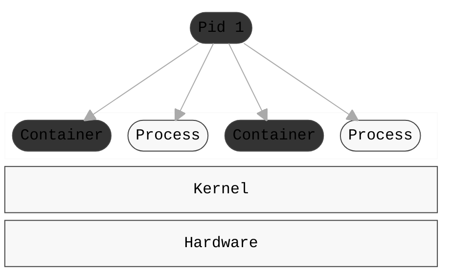
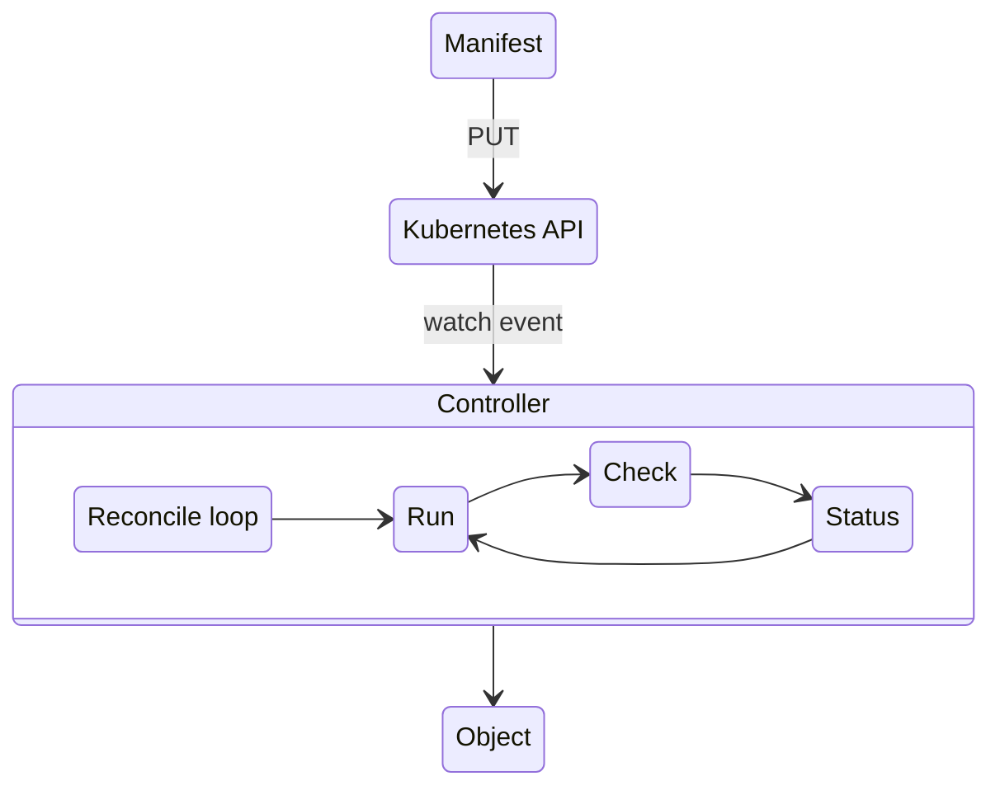

---
# try also 'default' to start simple
theme: default
title: Kubernetes training
date: 15.1.2026
author: Jan Dvořák
email: jan.dvorak@rocketmail.com
info: |
  ## Slidev Starter Template
  Presentation slides for developers.

  Learn more at [Sli.dev](https://sli.dev)
# apply UnoCSS classes to the current slide
layout: cover
# https://sli.dev/features/drawing
drawings:
  persist: false
transition: slide-left
mdc: true
duration: 40min
---


---
layout: simple
---

::header::

Co jsou kontejnery

::left::

- kontejner je izolovaný linuxový process
- není to VM!
- běží v kontextu operačního systému
    - jeho scheduleru
    - využíva jeho zdroje

::right::


---
layout: simple
---

::header::

Filosofie

::left::

- kontejner je process uzavřený v tzv. namespacech
- je spouštěn z tzv. image
- "vidí" omezené zdroje 
    - síťové interface
    - vlastní mountpointy
    - ipc, time domain, atd, apod

---
layout: simple
showBox: true
---

::header::

Linux namespaces

::left::
- Izoluji cast zdroju pro dany process
- Mají vliv na viditelnost 
::right::
<IconBox
  title="Namespaces"
  :show="$frontmatter.showBox"
  :items="[
    {
      icon: 'streamline-sharp:3d-scale',
      text: 'Pid'
    },
    {
      icon: 'streamline-sharp:database',
      text: 'Mount'
    },
    {
      icon: 'streamline-sharp:3d-move',
      text: 'Network'
    },
    {
      icon: 'streamline-sharp:alien',
      text: 'User'
    },
    {
      icon: 'streamline-sharp:reset-clock',
      text: 'Time'
    },
    {
      icon: 'streamline-sharp:bullet-list',
      text: 'Cgroup'
    },
    {
      icon: 'streamline-sharp:layers-1',
      text: 'UTS'
    }
  ]"
/>

---
layout: twist
twistAt: 5
---

::header::

Co je manifest

::left::

```yaml [deployment.yaml] {all|1-2|8-9|3-7|10-13|all} twoslash
apiVersion: apps/v1
kind: Deployment
metadata:
  annotations:
    deployment.kubernetes.io/revision: "1"
  labels:
    app: simpleapi
  name: simpleapi
  namespace: simpleapi
spec:
  progressDeadlineSeconds: 600
  replicas: 1
  revisionHistoryLimit: 10
  ...
```

::right::

<div class="note" v-if="$slidev.nav.clicks === 1">

##### ApiVersion a Kind:

- apiVersion: verze v rámci api
- Kind: typ objektu
  - Pod
  - Deployment
  - Service
  - ConfigMap

</div>

<div class="note" v-else-if="$slidev.nav.clicks === 2">

##### Name a Namespace:

- Name: jméno objektu
- Namespace: kde objekt leží
- V podstatě cesta v rámci clusteru
</div>

<div class="note" v-else-if="$slidev.nav.clicks === 3">

##### Labels and annotations:

- key/val hodnota
- Labels se častó používají v rámci tzv. selectorů
- Annotations jsou doplňkové informace které mohou měnit konfiguraci controllerů
</div>


<div class="note" v-else-if="$slidev.nav.clicks === 4">

##### Spec:

- specifikace(konfigurace) v rámci konkretního typu objektu (Kind)
- příklady:
  - Deployment definujem počet replik
  - Service potřebuje znát tcp porty
  - Secret obsahuje kódovaná data
  - atd apod.

</div>

<div class="note" v-else-if="$slidev.nav.clicks === 5">
</div>

::twist::

<div class="note" v-if="$slidev.nav.clicks === 5">

  Deklarativní popis cílového stavu!

</div>
---
layout: simple
---

::header::

Workflow

::left::

- Uživatel/Pipeline aplikuje manifest
- Kubernetes zoloží objekt
- Kubernetes vyvolá event controlleru
- Controller provede reconciliaci
- Výsledný stav propíše do "status"

::right::

