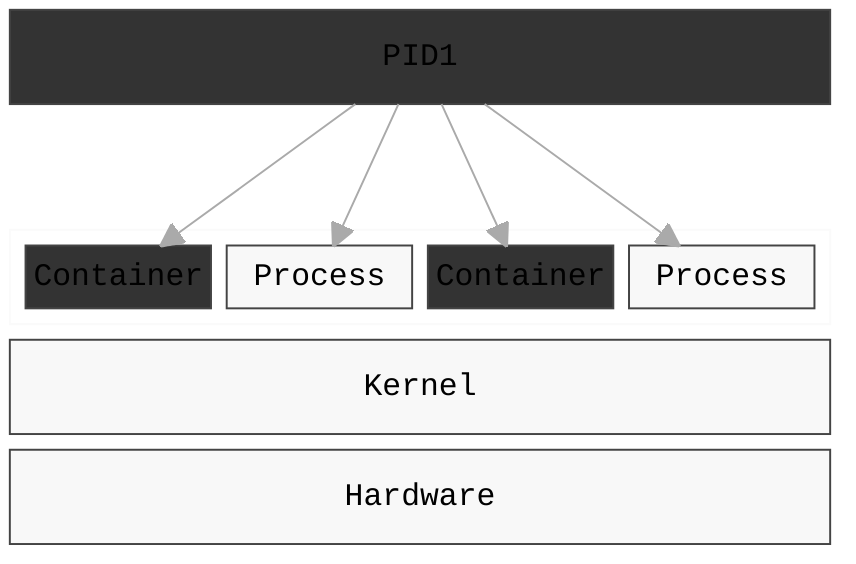

---
# try also 'default' to start simple
theme: default
title: Kubernetes training
date: 15.1.2026
author: Jan Dvořák
email: jan.dvorak@rocketmail.com
info: |
  ## Slidev Starter Template
  Presentation slides for developers.

  Learn more at [Sli.dev](https://sli.dev)
# apply UnoCSS classes to the current slide
layout: cover
# https://sli.dev/features/drawing
drawings:
  persist: false
transition: slide-left
mdc: true
duration: 40min
---

---
layout: simple
---

::header::

Co jsou kontejnery

::left::

- kontejner je izolovaný linuxový process
- není to VM!
- běží v kontextu operačního systému
    - jeho scheduleru
    - sdilí s ním zdroje.

::right::

---
layout: simple
---

::header::

Filosofie

::left::

- kontejner je process uzavřený v tzv. namespacech
- je spouštěn z tzv. image
- "vidí" omezené zdroje 
    - síťové interface
    - vlastní mountpointy
    - ipc, time domain, atd, apod
